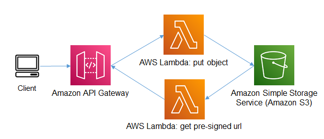

## Example
This is a basic CDK TypeScript example that deploys 2 AWS Lambda functions. One function will be used to put an object into Amazon S3, the second Lambda function is used to generate a pre-signed url that will be used to download the object from Amazon S3.



## Setup

[Getting started with AWS CDK](https://docs.aws.amazon.com/cdk/latest/guide/getting_started.html)

1. The following prerequisities are required for this example
  
```bash
npm install -g typescript
npm install -g aws-cdk
```
Install Jupyter Notebook following instructions on this ['site'](https://jupyter.org/install).

2. Since this CDK project uses ['Assests'](https://docs.aws.amazon.com/cdk/latest/guide/assets.html), you might need to run the following command to provision resources the AWS CDK will need to perform the deployment.

```bash 
cdk bootstrap
```

2. Install the dependencies

```bash
npm install
```

3. Execute **cdk synth** to synthesize as AWS CloudFormation template

```bash
cdk synth
```

4. Execute **cdk deploy** to deploy the template and build the stack

```bash
cdk deploy
```

5. Open the Jupyter Notebook in the **jupyter_notebook directory** follow the instructions.

6. Check the Amazon S3 bucket for the objects.