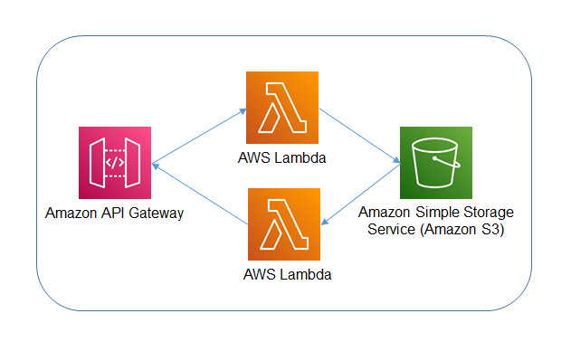

## Example
This is a basic CDK TypeScript example that deploys 2 AWS Lambda functions. One function will be used to put an object into Amazon S3 while the other is used to generate a pre-signed url that will be used to download the object from Amazon S3.



## Setup

1. The following prerequisities are required for this example
  
```bash
npm install -g typescript
npm install -g aws-cdk
```

2. Since this CDK project uses ['Assests'](https://docs.aws.amazon.com/cdk/latest/guide/assets.html), you might need to run the following command to provision resources the AWS CDK will need to perform the deployment.

```bash 
cdk bootstrap
```

2. Install the dependencies

```bash
npm install
```

3. Execute **cdk synth** to synthesize as AWS CloudFormation template

```bash
cdk synth
```

4. Execute **cdk deploy** to deploy the template and build the stack

```bash
cdk deploy
```

5. The API Gateway will be deployed by the stack and can be tested using the following json object.

```bash
{
  "order": {
    "orderid": "3",
    "coffeetype": "Flat white",
    "coffeesize": "Small",
    "vendorid": "1"
  }
}
```

6. You can also test using curl , make sure you replace `<api gateway>` with your gateway address and change the orderid in data.json for each execution. 

```bash
curl <api gateway>/invoice -d '@data.json' -H "Content-Type: application/json"
```

7. Use Curl or browse to the api, making sure you pass a query string parameter with your orderid.

```bash
curl <api gateway>/invoice?orderid=3
```

8. Follow the pre-signed url that was return and you will see the object.